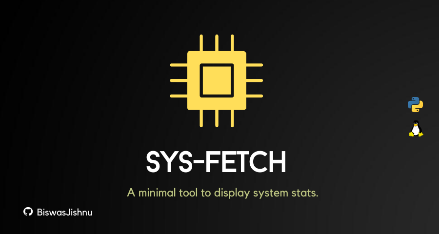
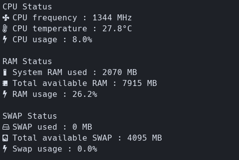

# Sysfetch
A minimal tool to display system stats.
 

## Dependencies

* [python](https://www.python.org/) - For obvious reasons.
* [psutil](https://pypi.org/project/psutil/) - Python library for getting system information.
* [Nerd Font Hack](https://github.com/ryanoasis/nerd-fonts/tree/master/patched-fonts/Hack) - Patched font used to display icons.
 
## Screenshots

